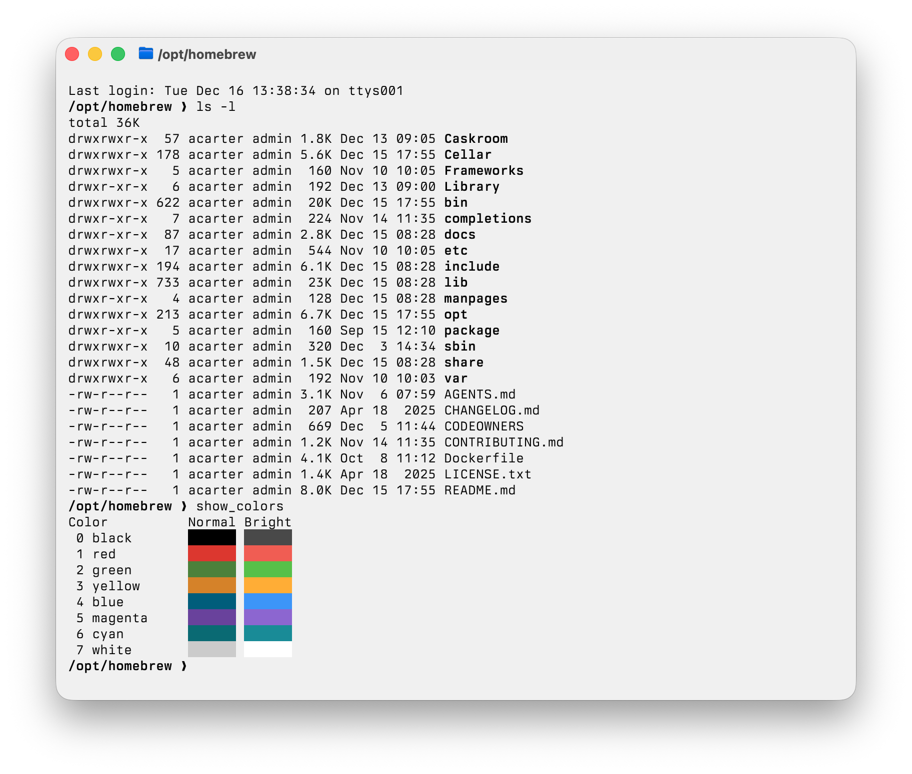

# ghostty-alpental-theme

Alpental dark and light themes for Ghostty.




## Usage

Add the following to your `~/.config/ghostty/config`:

```ini
theme = light:alpental-light,dark:alpental-dark
```

## Prerequisites
- Install the [veneer-theme](https://github.com/ascarter/veneer-theme) CLI used to build the theme assets:
  ```sh
  cargo install --git https://github.com/ascarter/veneer-theme
  ```
- Install [just](https://just.systems) for running the task recipes:
  ```sh
  brew install just
  ```

## Build
- Generate the compiled theme files:
  ```sh
  just build
  ```

The output ends up in `themes/` and can be linked or copied into your Ghostty config.
